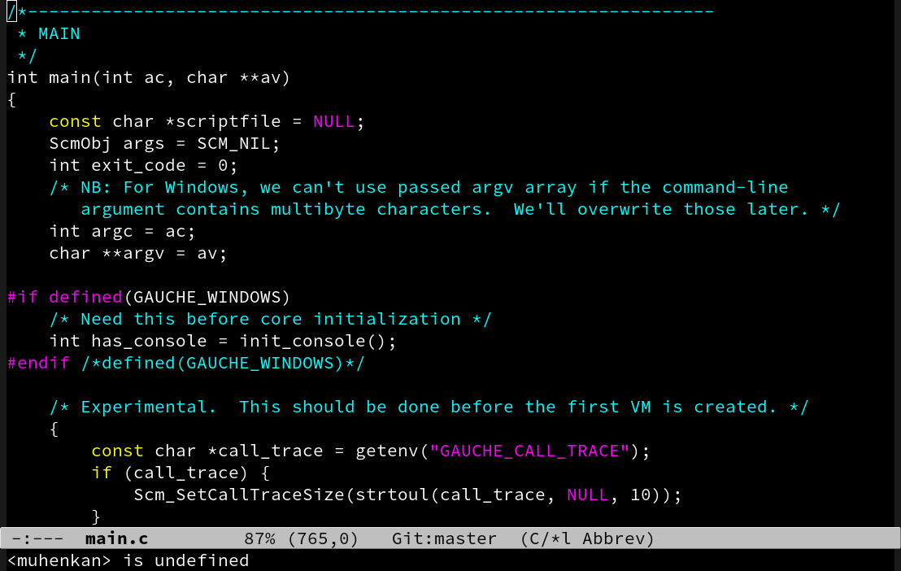
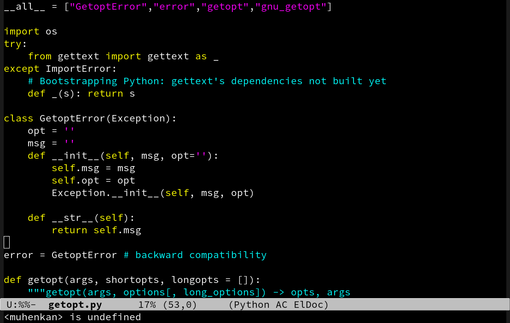
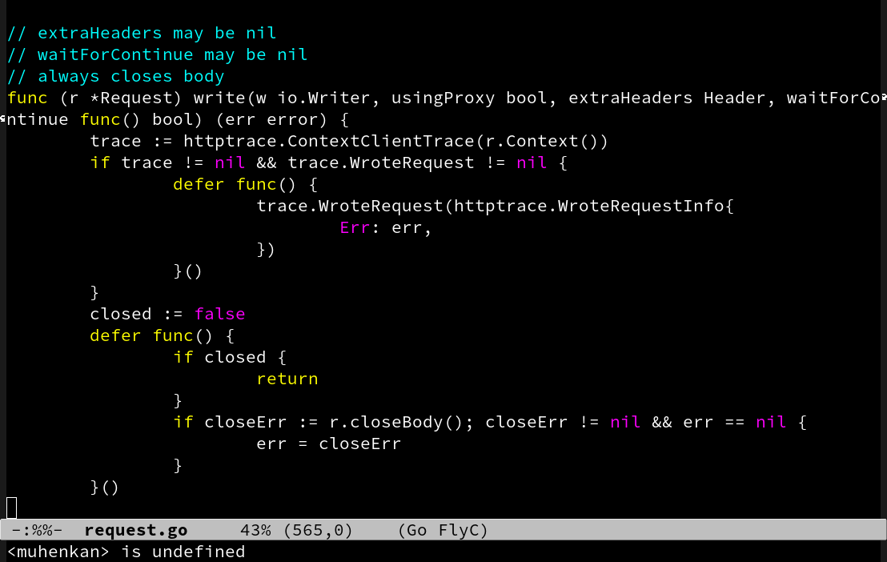

# kminimal

a emacs minimal color theme.

# Install

Copy kminimal-theme.el to load-path (or custom-theme-load-path).

```shell
$ cp kminimal-theme.el <LOAD-PATH>
```

Then call `load-theme`.
```elisp
(load-theme 'kminimal t)
```

# Screenshots

[](image/c.png)
[](image/python.png)
[](image/go.png)

# License

public domain
